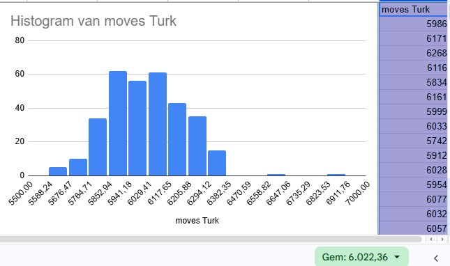
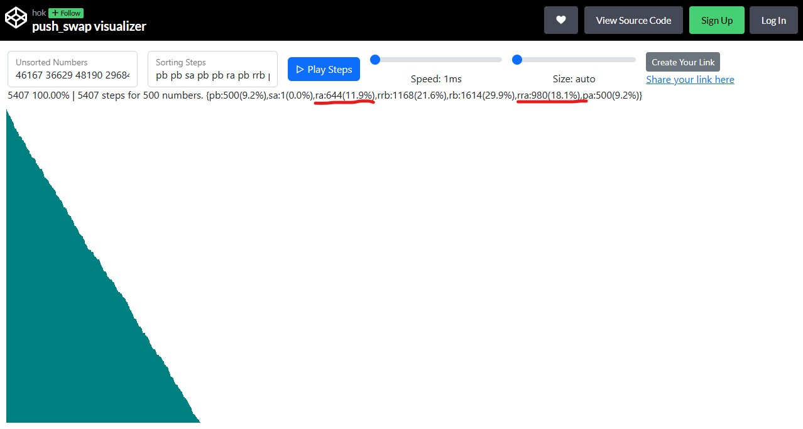

This README is designed to highlight the technical decision-making and the sophisticated logic behind the **Dipole Algorithm**. It emphasizes the `sort_big` logic (the Branch and Bound approach) as the primary engine while showcasing the recursive 5-sort as a clean "Divide and Conquer" utility.

---

# How to install:

- this project runs on linux OS or similar
- download the code using git clone or any other recommended method
- you should have `cmake` and the `cc` compiler installed
- run `make` on the root
- check that the bash scripts can be run on linux, otherwise convert them from dos to linux format (eg using `dos2unix`); or just make your own tests
- change the permissions for the test files on the root or run the following command:

```
ARG=$(shuf -i 0-1000 -n 100); ./push_swap $ARG | wc -l
```

# possible todos

> _for those who are looking for a performing algo which is completely different to the turk, chunk, lis, or radix, and are not scare to take this project to another level_

I left this project as it was. The **dipole algo** in particular was a continuation of a promising route that I had to abandon in favour of the Radix algo, as my pace expiration date was approaching. The small sorting algos presented here where also presented during the evaluation.

That means that particularly the dipole algo is still open to improvements. For example:

- Some scripts and functions require further refactoring to comply with the Norm
- When modifying the linked list, I chose to update the data stored in the nodes instead of swapping the nodes themselves.

Swapping data instead of the nodes themselves was a poor design choice: I did it to minimize errors associated to leaking but even if it works it is not technically "sounding" for this project. In other words, it is not _good code_. And in fact, switching to swapping the nodes when updating the linked list would likely make this algo run even faster (runtime-wise).

In terms of **perfomance based on valid moves**, there is also room for improvement, for example:

- the double moves logic is not implemented
- the final step of bringing the poles into a single sequence on A can have a small improvement

The implementation of double moves, in particular, will definitively result in less valid moves, but it will also reduce its statistic dispersion (see discussion further below).

# Extras that you might find positive when inspecting this project:

- I do my best to keep a solid architecture
- I do my best to keep solid code
- I do my best to keep a good tracking of leakings, implement error handling, etc
- My libft is in full too

# Description of the algos

## 1. An option for the small Sort: Recursive State Reduction (N <= 5)

Instead of traditional hard-coded conditional blocks, this project uses a **Recursive Divide and Conquer** strategy for small datasets.

- **Recursive Step:** The algorithm identifies the extreme value, pushes it to Stack B, and calls itself for .
- **Base Case:** Once the stack is reduced to , it triggers an optimized 3-node permutation sort.
- **Backtracking:** As the recursion unfolds, the isolated values are pushed back into their perfectly sorted positions.

## 2. The Dipole Algorithm (N > 5)

A high-performance sorting solution for the 42 Push_Swap project, achieving **5200 moves (average) for 500 elements** even without double-move optimization. Put simply, it consists of trying to keep the sorted order of two opposing sequences ("poles") on the B stack after moving one element from A, and once all elements from A have been placed on one of the opposing sequences on B sort those two sequences back as one single sort into the A stack.

### 1. The Core Engine: Dipole Search

The algorithm treats Stack B as a "field" with two opposing sorted sequences that have orientation: one sequence has **positive** orientation, and the other one has **negative** orientation.

#### A. Branch and Bound Search

The process to get an element from A that should be placed on B is not random. It consists in finding and comparing the **candidates with the less amount of movements to be placed in one or another "pole"**. The selection process is not a simple linear scan. It employs **Branch and Bound pruning** to minimize calculation overhead:

- **Initial Bound:** The algorithm calculates the cost of the candidate at the `head` of Stack A to establish a "Distance Budget."
- **The Branching:** It then branches out, searching from both the **Top** and then the **Bottom** of Stack A.
- **The Pruning:** If the cost to simply reach a node (its distance from the head/tail) exceeds the current "Distance Budget," the algorithm **prunes** that branch and discards those nodes that won't beat the current budget. As it is now for this version, the budget is only updated after exploring the elements of the **Top** branch. The new budget is then used to prune the candidates of the **Bottom** branch.

#### B. The Dipole (Perspective Shifting)

To solve the "tail-to-head" gap problem inherent in circular lists, the algorithm uses a **Perspective Shift technique**:

- Before calculating costs, it performs a temporary `reverse_rotate` to shift the stack's orientation.
- This brings the "invisible" gap between the last and first nodes into the primary search loop.
- By shifting the perspective, the algorithm treats the circular wrap-around as a standard sequence, ensuring 100% accuracy in finding the optimal insertion point.

### 2. Performance Table based on valid moves

| Dataset Size     | Dipole Move Count (Est.) | 42 Project Limit (5/5) | Performance Grade     |
| ---------------- | ------------------------ | ---------------------- | --------------------- |
| **3 Elements**   | 2-3                      | 3                      | Perfect               |
| **5 Elements**   | 8-11                     | 12                     | Optimized (Recursive) |
| **100 Elements** | **580** average          | 700                    | Elite Tier            |
| **500 Elements** | **5200** average         | 5500                   | Elite Tier            |

The following chart shows the performances (number of moves) of 1000 sortings of sets of 500 random elements:


For comparison, I tried the same experiement on a randomly selected [Github project](https://github.com/MariPeshko/push_swap) claiming to implement a "**mechanical turk**" variant, which apparently included double moves. The tests were taking a long time (over 5 minutes) so the run was stopped early. Although only ~330 results were collected, that was enough to indicate a trend.



However, whatever promising, this single comparison might not be fair enough to completely demonstrate the differences between the turk implementations and the dipole algo given possible divergences in student's implementations of the turk algo.

#### Explaining the positive skewness and how to improve it

As it can be seen from the histogram, the algo shows a visible positive skewness.

I haven't really studied why. One possible explanation is that for some cases the elements might be by chance grouped in small alternate sequences of small and then larger rank elements across the stack A right from the beginning.

That could force the algo to have jump alternations as it digs deeper into the stacks when finding a significant discrepancy in the characteristics of the candidates.

The following screenshot shows that my dipole algo does a lot of rotate - and reverse rotate moves in order to find the right candidate. Notice the number of rotate and reverse-rotate moves on A compared to same moves on B:


(_the chart was obtained from [https://codepen.io/ahkoh/full/bGWxmVz](https://codepen.io/ahkoh/full/bGWxmVz); [this visualizer](https://push-swap42-visualizer.vercel.app/) was also frequently used; the test used for this specific case is the `test500-steps.sh` script_)

The moves on A are fully related to the sorting on B and they set the limit of what can be coupled as a single move (either `rr` or `rrr`).

Not all those moves can be couple: in some cases they occur in opposite directions in each stack. However, there is still a good chance that the implementation of double moves as valid moves not only could bring the average closer to a smaller number than 5200, but it could also reduce the variability and in particular the skewness seen in the previous graph where no double moves were implemented.Based on what I experienced while working on the push_swap project in general, I would say that the move coupling might result in a **reduction of between 5% to 20% moves**. In fact, my hypothesis is that:

> _the higher the deviation (ie. more moves that expected), the higher the effect of the double move reduction._

#### Why this logic is faster than the "Average"

Most of the projects settle for a simple "Radix" sort (which is roughly 1084 moves for 100) or a "Chunk" sort (which is roughly 700-800 moves).

This **Dipole Algorithm** is also more performant because:

1. **Branch and Bound:** this is not checking all the elements but only the ones that actually have a chance to win.
2. **Circular Efficiency:** the project implement a "smart rotation" trick that finds instantly some of the positions and move only when necessary.

### 3. Key Technical Tools Used

- **Greedy Optimization:** The project uses simple rules, selecting the locally optimal move at each step.
- **Dual-Path Heuristic**: By offering not one but two possible preliminary slots for some of the elements, the possibilities of finding a shortest path for some values doubles.
- **Heuristic Pruning:** Using the `distance_budget` to skip sub-optimal nodes.
- **Circular Invariant Management:** Ensuring the stack remains a perfect circular sequence through every push.

### 4. Challenges

Challenges of the project are:

- **Changing "polarities"** - Making the right comparisons and then keeping the correct orientations of the elements when exploring and eventually placing elements between "poles" or "fields"
- **Treating the limits** - how to place local or global maxs or mins values for any of the existing poles and correctly assigning an orientation (maxs and mins, when found together, involve a change in "polarity")
- **Circularity** - this is specially difficult notion to grasp: calculating if an element should be placed as jammed between the head and the tail of B is not immediately trivial (this is well solved in this project by _problem simplification_)

---


---
